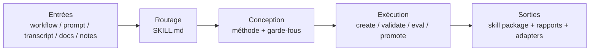

# Présentation de Yao Meta Skill

`YAO = Yielding AI Outcomes` signifie produire de vrais résultats grâce à l'IA. L'objectif n'est pas d'écrire davantage de texte de prompt, mais de livrer des actifs IA réutilisables et des résultats opérationnels concrets.

`yao-meta-skill` est un système léger mais rigoureux pour créer, évaluer, empaqueter et gouverner des agent skills réutilisables.

Il transforme des workflows bruts, des transcripts, des prompts, des notes et des runbooks en paquets de skills réutilisables avec :

- une surface de déclenchement claire
- un `SKILL.md` léger
- des references, scripts et evals optionnels
- un dialogue d'intention plus humain avant l'authoring approfondi, avec un intent confidence gate qui continue à clarifier si le vrai travail, la sortie, les exclusions ou les standards restent flous
- un benchmark scan GitHub silencieux par défaut, complété par une reference synthesis, qui étudie des dépôts publics de haute qualité et des patterns world-class, puis ne remonte à l'utilisateur que les vrais conflits ou les zones d'incertitude
- une demande explicite de références fournies par l'utilisateur quand elles existent, afin d'apprendre des modèles, pas de copier le texte ni du contenu privé
- un rapport HTML minimaliste en fond blanc généré automatiquement pour chaque nouveau skill
- trois directions d'itération à plus forte valeur après la première création
- un review viewer HTML compact pour accélérer la première revue humaine
- un feedback log léger pour éviter de lancer tout le flux de promotion à chaque tour
- un rapport with-skill vs baseline pour visualiser rapidement le gain incrémental
- un quickstart conversationnel, sensible aux archetypes, pour orienter un nouveau skill vers scaffold, production, library ou governed
- des métadonnées sources neutres et des adaptateurs spécifiques au client
- des contrôles de gouvernance, de promotion et de portabilité intégrés au flux standard

## Architecture

En version hero, le système tient sur une seule ligne : transformer une entrée brouillonne en skill package gouverné et réutilisable.



Lecture en 10 secondes :

- **Entrées** : on part de workflows, prompts, documents et notes dispersés.
- **Routage** : un `SKILL.md` léger définit d'abord la frontière et le déclenchement.
- **Conception** : on choisit le bon archetype, les bons gates et la bonne séparation des ressources.
- **Exécution** : la CLI unifiée construit, valide, optimise et promeut le skill.
- **Sorties** : on obtient un skill package réutilisable avec ses preuves d'évaluation, de gouvernance et de portabilité.

## Benchmark qualité pondéré

Ce benchmark est une revue d'ingénierie du projet. Chaque dimension est notée de `0-10`, puis pondérée sur `100`. Les GitHub stars ne sont pas incluses, car elles mesurent la chaleur de l'écosystème, pas directement la qualité d'ingénierie d'une méta-skill.

Formule du score pondéré : `sum(score / 10 * poids)`.

| Méta-skill | Méthode 15 | Discipline contexte 10 | Toolchain 15 | Eval/tests 20 | Gouvernance 15 | Portabilité 10 | Onboarding/revue 5 | Fiabilité locale 10 | Score pondéré |
| --- | ---: | ---: | ---: | ---: | ---: | ---: | ---: | ---: | ---: |
| Yao Meta Skill | 9.5 | 8.0 | 9.5 | 9.5 | 9.5 | 9.0 | 6.5 | 9.5 | 91.5 |
| Anthropic Skill Creator | 9.0 | 6.5 | 8.5 | 7.5 | 4.0 | 5.0 | 7.5 | 5.0 | 67.5 |
| OpenAI Skill Creator | 8.5 | 9.5 | 5.0 | 2.0 | 3.0 | 4.0 | 8.5 | 4.0 | 50.5 |

| Rang | Méta-skill | Score | Positionnement central |
| ---: | --- | ---: | --- |
| 1 | Yao Meta Skill | 91.5 | Système complet d'ingénierie, d'évaluation, de gouvernance et de portabilité pour skills réutilisables. |
| 2 | Anthropic Skill Creator | 67.5 | Méthode et boucle d'itération fortes, mais fiabilité locale et gouvernance plus faibles. |
| 3 | OpenAI Skill Creator | 50.5 | Très utile comme guide concis d'écriture de skills, moins comme système d'ingénierie complet. |

## Scénarios recommandés

- Choisissez **Yao Meta Skill** si vous voulez un actif d'équipe réutilisable avec frontières explicites, gates d'évaluation, gouvernance, portabilité et maintenance à long terme.
- Choisissez **Anthropic Skill Creator** si vous voulez une boucle de création d'abord conversationnelle et une itération guidée par l'humain.
- Choisissez **OpenAI Skill Creator** si vous cherchez surtout une référence concise pour écrire des skills légères avec une forte discipline de contexte.
- Un schéma hybride utile consiste à produire un premier jet avec un creator conversationnel, puis à utiliser `yao-meta-skill` pour durcir le package et le rendre prêt pour une équipe.

## Démarrage rapide

1. Décrivez le workflow, l'ensemble de prompts ou la tâche répétée que vous voulez transformer en skill.
2. Commencez par un court dialogue d'intention plus humain pour clarifier le vrai travail, les sorties attendues, les exclusions, les contraintes et les standards qui comptent pour vous.
3. Laissez d'abord `quickstart` clarifier l'intention, puis lancer silencieusement benchmark scan et reference synthesis ; des questions explicites ne remontent que si l'intention reste ambiguë ou si deux directions de conception se contredisent réellement.
4. Utilisez le `quickstart` sensible aux archetypes ou le flux complet d'authoring pour générer ou améliorer le paquet en mode scaffold, production, library ou governed.
5. Chaque nouveau skill reçoit aussi `reports/intent-dialogue.md`, `reports/intent-confidence.md`, `reports/reference-synthesis.md`, `reports/skill-overview.html`, `reports/review-viewer.html` et `reports/iteration-directions.md`. Ensuite, le feedback log et le baseline compare permettent de boucler rapidement sans lancer tout le flux de promotion.

## Résultats actuels

- `make test` passe actuellement
- sur le jeu de régression courant, trigger eval a `0` faux positifs et `0` faux négatifs
- les suites train / dev / holdout passent toutes
- les expressions chinoises réelles sont maintenant couvertes dans trigger eval, par exemple `做一个 skill`, `沉淀成可复用能力`, `优化已有 skill`, `补 trigger 评测`
- les contrats de packaging `openai`, `claude` et `generic` sont validés

## Points forts actuels

Dans la dernière revue pondérée, Yao atteint `91.5/100`. Les points forts se concentrent sur ce qui rend une skill durablement exploitable par une équipe :

- **Profondeur méthodologique `9.5`** : doctrine de skill engineering, archetypes, gate selection, non-skill decisions, gouvernance et frontières de ressource sont formalisés.
- **Complétude de la toolchain `9.5`** : initialisation, validation, benchmark scan, description optimization, reporting, contrôle de promotion, packaging, CI et portability checks sont reliés dans un même flux.
- **Rigueur Eval / tests `9.5`** : train/dev/holdout, blind holdout, adversarial holdout, judge-backed blind eval, route confusion, drift history et promotion gates sont couverts.
- **Gouvernance / cycle de vie `9.5`** : les skills importantes peuvent porter owner, lifecycle, review cadence, maturity score, trust boundary, promotion decision et regression history.
- **Fiabilité d'exécution locale `9.5`** : le dépôt est vérifiable localement avec `make test`, `make ci-test` et la CLI unifiée.
- **Portabilité / distribution `9.0`** : métadonnées neutres, adaptateurs, règles de dégradation, contrats de packaging et score de portabilité conservent la sémantique réutilisable entre environnements.
- **Discipline de contexte `8.0`** : le point d'entrée reste sous budget, mais cette contrainte est suivie activement car le système porte davantage de rapports, exemples, benchmarks et preuves.
- **Onboarding / revue `6.5`** : quickstart, HTML overview, side-by-side review viewer et feedback log ont amélioré la première expérience, mais c'est encore la principale zone d'amélioration UX.

La direction est volontaire : garder une entrée légère, rendre l'évaluation difficile à simuler, rendre la gouvernance visible, et réduire encore la friction de création et de revue.

## Pourquoi Yao

- **Léger** : le point d'entrée reste compact, les budgets de contexte sont explicites, et la structure supplémentaire n'est ajoutée que lorsqu'elle apporte une vraie valeur.
- **Rigoureux** : la qualité de déclenchement est vérifiée par family regressions, blind holdout, adversarial holdout, route confusion, judge-backed blind eval et promotion gates.
- **Gouvernable** : les skills importantes sont traitées comme des actifs maintenables avec lifecycle, attentes de maturité, ownership et cadence de revue.
- **Portable** : les métadonnées source restent neutres, tandis que les adaptateurs, règles de dégradation et contrats de packaging préservent une sémantique réutilisable entre environnements.

## Ce que fait le projet

Ce projet permet de créer, refactoriser, évaluer et empaqueter des skills comme des briques de capacité durables plutôt que comme des prompts ponctuels.

Sa logique de conception est simple :

1. identifier le vrai travail récurrent derrière la demande
2. définir une frontière propre pour que chaque paquet fasse un travail cohérent
3. optimiser la description de déclenchement avant d'allonger le corps
4. garder le fichier principal compact et déplacer le détail vers les references ou les scripts
5. ajouter des garde-fous qualité seulement lorsqu'ils sont utiles
6. exporter des artefacts de compatibilité uniquement pour les clients nécessaires

## Pourquoi ce projet existe

Dans la plupart des équipes, la connaissance opérationnelle utile est dispersée dans les chats, les prompts personnels, les habitudes orales et les workflows non documentés. Ce projet convertit cette connaissance implicite en :

- paquets de skills découvrables
- flux d'exécution répétables
- instructions à faible coût de contexte
- actifs réutilisables pour l'équipe
- distributions prêtes pour la compatibilité

## Structure du dépôt

```text
yao-meta-skill/
├── SKILL.md
├── README.md
├── LICENSE
├── .gitignore
├── agents/
│   └── interface.yaml
├── references/
├── scripts/
└── templates/
```

## Composants principaux

### `SKILL.md`

Le point d'entrée principal. Il définit la surface de déclenchement, les modes opératoires, le workflow compact et le contrat de sortie.

### `agents/interface.yaml`

La source de vérité neutre pour les métadonnées. Ce fichier stocke les informations d'affichage et de compatibilité sans lier l'arborescence source à un chemin spécifique à un fournisseur.

### `references/`

Les documents longs qui ne doivent pas gonfler le fichier principal. On y trouve les règles de conception, les guides d'évaluation, la stratégie de compatibilité et les rubriques de qualité.

### `scripts/`

Des utilitaires qui rendent la méta-skill opérationnelle :

- `trigger_eval.py` : vérifie si une description de déclenchement est trop large ou trop faible
- `context_sizer.py` : estime le poids de contexte et avertit si le chargement initial devient trop grand
- `cross_packager.py` : génère des artefacts d'export spécifiques au client à partir du paquet source neutre

### `templates/`

Des modèles de départ pour des paquets simples ou plus avancés.

## Comment l'utiliser

### 1. Utiliser directement la skill

Invoquez `yao-meta-skill` lorsque vous souhaitez :

- créer une nouvelle skill
- améliorer une skill existante
- ajouter des evals à une skill
- transformer un workflow en paquet réutilisable
- préparer une skill pour une adoption plus large dans l'équipe

### 2. Générer un nouveau paquet de skill

Le flux typique est :

1. décrire le workflow ou la capacité
2. identifier les phrases de déclenchement et les sorties attendues
3. choisir le mode scaffold, production ou library
4. générer le paquet
5. lancer les vérifications de taille et de déclenchement si nécessaire
6. exporter les artefacts de compatibilité ciblés

### 3. Exporter des artefacts de compatibilité

Exemples :

```bash
python3 scripts/cross_packager.py ./yao-meta-skill --platform openai --platform claude --zip
python3 scripts/context_sizer.py ./yao-meta-skill
python3 scripts/trigger_eval.py --description "Create and improve agent skills..." --cases ./cases.json
```

## Avantages

- **Méthode d'abord, pas prompt d'abord** : la création de skill est traitée comme un workflow d'ingénierie formel
- **Pensé pour l'optimisation du déclenchement** : les descriptions passent par route confusion, blind holdout, familles adversariales et promotion policy
- **Léger au point d'entrée** : `SKILL.md` reste compact et les references, scripts, evals ne sont ajoutés que lorsqu'ils sont utiles
- **Outillage cohérent** : initialisation, validation, optimisation, reporting, packaging et test passent par un CLI et un chemin CI unifiés
- **Gouverné comme un actif** : les skills importantes peuvent porter ownership, lifecycle, attentes de maturité et cadence de revue
- **Portable par défaut** : les sources restent neutres et la compatibilité est gérée par des adaptateurs et des règles de dégradation
- **Riche en preuves** : route scorecards, regression history, context budgets, portability scores et promotion decisions sont publiés comme artefacts

## Public idéal

Ce projet est particulièrement adapté à :

- constructeurs d'agents
- équipes d'outillage interne
- prompt engineers évoluant vers des skills structurées
- organisations construisant des bibliothèques de skills réutilisables

## Licence

MIT. Voir [LICENSE](../LICENSE).
