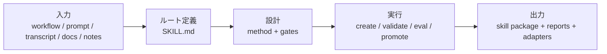

# Yao Meta Skill 日本語紹介

`YAO = Yielding AI Outcomes` は、「AI の結果を実際の成果として届ける」という意味です。単に prompt テキストを増やすのではなく、再利用可能な AI 資産と実運用の成果を作ることを重視します。

`yao-meta-skill` は、再利用可能な agent skill を作成・評価・パッケージ化・運用するための、軽量で厳密なシステムです。

粗い workflow、transcript、prompt、notes、runbook を、再利用可能な skill パッケージに変換し、次の性質を持たせます。

- 明確なトリガー面
- 軽量な `SKILL.md`
- 必要に応じた references、scripts、evals
- 深い authoring の前に、人間味のある短い intent dialogue を行い、intent confidence gate で理解が十分かを判定する。不十分なら 1〜2 個の高レバレッジ質問を追加する
- 深い authoring の前に、GitHub benchmark scan と reference synthesis を静かに実行し、高品質な公開リポジトリと world-class pattern tracks を参照する。実際に衝突や不確実性があるときだけユーザーに明示する
- ユーザー自身の参考例があれば、それも取り込み、文章ではなくパターン・構造・品質基準だけを学ぶ
- 新しい skill ごとに、白背景の簡潔な HTML overview を自動生成
- 初回作成後に自動で提示される 3 つの高価値な次の iteration direction
- 初回の人間レビューを助ける、コンパクトな HTML review viewer
- 毎回フル promotion flow を通さずに使える軽量 feedback log
- 増分価値をすばやく確認できる with-skill vs baseline 比較レポート
- 会話型 discovery flow として scaffold / production / library / governed を案内する archetype-aware quickstart
- 中立的なソースメタデータとクライアント別アダプタ
- ガバナンス、昇格判定、portability チェックを標準フローに内蔵

## アーキテクチャ

Hero 版では、全体の流れは 1 本です。ばらばらの入力を、統制された再利用可能な skill package に変えます。



10 秒で読むならこうです。

- **入力**: workflow、prompt、文書、メモなどの粗い素材から始めます。
- **ルート定義**: まず軽量な `SKILL.md` で境界と trigger を決めます。
- **設計**: 適切な archetype、gate、資源の分割を選びます。
- **実行**: 統一 CLI で作成、検証、最適化、昇格を進めます。
- **出力**: 最終的に skill package と、評価・ガバナンス・移植性の証拠が残ります。

## 加重品質ベンチマーク

これはプロジェクトのエンジニアリング品質レビューです。各項目を `0-10` で評価し、重みづけして `100` 点満点に換算します。GitHub stars は、エコシステム上の注目度を示すもので、meta-skill の工学的品質を直接示すものではないため、総合点には含めません。

加重スコアの式: `sum(score / 10 * weight)`。

| Meta Skill | 方法論 15 | 文脈規律 10 | ツールチェーン 15 | Eval/テスト 20 | ガバナンス 15 | 移植性 10 | 導入/レビュー 5 | ローカル信頼性 10 | 加重スコア |
| --- | ---: | ---: | ---: | ---: | ---: | ---: | ---: | ---: | ---: |
| Yao Meta Skill | 9.5 | 8.0 | 9.5 | 9.5 | 9.5 | 9.0 | 6.5 | 9.5 | 91.5 |
| Anthropic Skill Creator | 9.0 | 6.5 | 8.5 | 7.5 | 4.0 | 5.0 | 7.5 | 5.0 | 67.5 |
| OpenAI Skill Creator | 8.5 | 9.5 | 5.0 | 2.0 | 3.0 | 4.0 | 8.5 | 4.0 | 50.5 |

| 順位 | Meta Skill | スコア | 中核ポジション |
| ---: | --- | ---: | --- |
| 1 | Yao Meta Skill | 91.5 | 工学化、評価化、ガバナンス化、移植性まで含む完全な meta-skill システム。 |
| 2 | Anthropic Skill Creator | 67.5 | 方法論と反復ループは強いが、ローカル実行信頼性とガバナンス範囲は弱めです。 |
| 3 | OpenAI Skill Creator | 50.5 | 完全な工学システムというより、簡潔な skill 作成ガイドとして有用です。 |

## 適したシナリオ

- **チーム再利用、明確な境界、評価ゲート、ガバナンス、移植性、長期保守**を重視するなら `Yao Meta Skill` が向いています。
- **会話優先の作成ループと人間主導の反復**を重視するなら `Anthropic Skill Creator` が向いています。
- **簡潔な skill 作成ガイドと文脈規律の見本**が必要なら `OpenAI Skill Creator` が向いています。
- 実務的な組み合わせとしては、会話的な creator で初稿を作り、その後 `yao-meta-skill` で harden して team-ready な asset にする、という流れが有効です。

## クイックスタート

1. skill 化したい workflow、prompt 集合、または反復タスクを説明します。
2. まず短いが人間味のある intent dialogue で、実際の job、outputs、boundary、constraints、重視する品質基準を明確にします。
3. まず `quickstart` で意図を澄ませ、その後 benchmark scan と reference synthesis を静かに実行します。意図がまだ曖昧なとき、または設計ルートに本当の衝突があるときだけ、追加確認を明示します。
4. archetype-aware な `quickstart` か完全な authoring flow を使い、scaffold、production、library、governed のいずれかでパッケージを生成または改善します。
5. 新しく作成した skill には `reports/intent-dialogue.md`、`reports/intent-confidence.md`、`reports/reference-synthesis.md`、`reports/skill-overview.html`、`reports/review-viewer.html`、`reports/iteration-directions.md` が付きます。さらに feedback log と baseline compare を使えば、毎回フル promotion flow を回さずに短い改善ループを回せます。

## 現在の結果

- 現在 `make test` は通過
- 現在の回帰セットでは trigger eval が `0` false positives / `0` false negatives
- train / dev / holdout の 3 層評価が通過
- 中国語の実利用表現も trigger 評価に追加済みです。例: `做一个 skill`、`沉淀成可复用能力`、`优化已有 skill`、`补 trigger 评测`
- `openai`、`claude`、`generic` の packaging contract が通過

## 現在の強み

最新の加重レビューでは、Yao は `91.5/100` です。強みは、長く使うチーム資産としての skill に必要な領域に集中しています。

- **方法論の深さ `9.5`**: skill engineering doctrine、archetype、gate selection、non-skill decision、governance、resource boundary が体系化されています。
- **ツールチェーン完成度 `9.5`**: 初期化、検証、benchmark scan、description optimization、レポート、昇格判定、パッケージ化、CI、portability checks が一つの運用フローに接続されています。
- **Eval / テスト厳密性 `9.5`**: train/dev/holdout、blind holdout、adversarial holdout、judge-backed blind eval、route confusion、drift history、promotion gate を備えています。
- **ガバナンス / ライフサイクル `9.5`**: 重要な skill に owner、lifecycle、review cadence、maturity score、trust boundary、promotion decision、regression history を持たせられます。
- **ローカル実行信頼性 `9.5`**: `make test`、`make ci-test`、統一 CLI でローカル再現できます。
- **移植性 / 配布 `9.0`**: ソースは中立に保ち、adapter、degradation rule、packaging contract、portability score で環境間の再利用性を担保します。
- **文脈規律 / 精簡性 `8.0`**: エントリポイントは budget 内に保たれていますが、レポート、例、benchmark、証拠資産が増えたため、継続的な制約として追跡しています。
- **導入 / レビュー体験 `6.5`**: quickstart、HTML overview、side-by-side review viewer、feedback log により初回体験は改善しましたが、ここは次に最も伸ばすべき UX 領域です。

全体の方向性は明確です。入口は軽く、評価は厳しく、ガバナンスは見える形にし、初回作成と人間レビューの摩擦をさらに下げていきます。

## なぜ Yao なのか

- **軽量**: エントリポイントは小さく保たれ、context budget は明示され、追加構造は本当に価値がある場合にだけ導入されます。
- **厳密**: trigger 品質は family regression、blind holdout、adversarial holdout、route confusion、judge-backed blind eval、promotion gate で検証されます。
- **ガバナンス可能**: 重要な skill は lifecycle、maturity expectation、owner、review cadence を持つ保守対象の資産として扱われます。
- **移植可能**: ソースメタデータは中立のまま保たれ、adapter、degradation rule、packaging contract が環境間の再利用意味論を保持します。

## 何をするものか

このプロジェクトは、skill を単発の prompt ではなく、作成・改善・評価・配布できる持続的な能力パッケージとして扱えるようにします。

設計ロジックは次の通りです。

1. ユーザーの依頼の背後にある反復的な仕事を特定する
2. skill の境界を整理し、1 つのパッケージを 1 つの一貫した役割に保つ
3. 本文を長くする前に trigger description を最適化する
4. メインの skill ファイルを小さく保ち、詳細は references や scripts に移す
5. 品質ゲートは必要なときだけ追加する
6. 本当に必要なクライアント向けにだけ互換出力を生成する

## なぜ必要か

多くのチームでは、重要な運用知識が chat、個人 prompt、口頭の習慣、未整理の workflow に散在しています。このプロジェクトは、それらの暗黙知を次の形に変換します。

- 発見可能な skill パッケージ
- 再現可能な実行フロー
- 低コンテキストな指示
- 再利用可能なチーム資産
- 配布しやすい互換パッケージ

## リポジトリ構成

```text
yao-meta-skill/
├── SKILL.md
├── README.md
├── LICENSE
├── .gitignore
├── agents/
│   └── interface.yaml
├── references/
├── scripts/
└── templates/
```

## 主要コンポーネント

### `SKILL.md`

メインの skill エントリです。トリガー面、動作モード、圧縮された workflow、出力契約を定義します。

### `agents/interface.yaml`

中立的なメタデータの単一ソースです。表示情報と互換性情報を保持し、ソースツリーを特定ベンダーのパスに固定しません。

### `references/`

メイン skill ファイルを肥大化させないための長文資料です。設計ルール、評価方法、互換戦略、品質 rubric を含みます。

### `scripts/`

この meta-skill を実用的にする補助スクリプトです。

- `trigger_eval.py`: trigger description が広すぎるか弱すぎるかを確認する
- `context_sizer.py`: コンテキスト量を見積もり、初期ロードが大きすぎる場合に警告する
- `cross_packager.py`: 中立的なソースパッケージからクライアント別出力を生成する

### `templates/`

単純な skill と複雑な skill を始めるためのテンプレートです。

## 使い方

### 1. この skill を直接使う

次のようなときに `yao-meta-skill` を使います。

- 新しい skill を作る
- 既存の skill を改善する
- skill に eval を追加する
- workflow を再利用可能なパッケージにする
- チーム向けに skill を整備する

### 2. 新しい skill パッケージを生成する

一般的な流れは次の通りです。

1. workflow または能力を説明する
2. trigger フレーズと出力を特定する
3. scaffold、production、library のいずれかを選ぶ
4. パッケージを生成する
5. 必要に応じてサイズチェックと trigger チェックを行う
6. 対象クライアント向けの互換出力を生成する

### 3. 互換出力を生成する

例:

```bash
python3 scripts/cross_packager.py ./yao-meta-skill --platform openai --platform claude --zip
python3 scripts/context_sizer.py ./yao-meta-skill
python3 scripts/trigger_eval.py --description "Create and improve agent skills..." --cases ./cases.json
```

## 利点

- **prompt ではなく方法論が中心**: skill creation を正式な engineering workflow として扱います
- **トリガー最適化を前提に設計**: description は route confusion、blind holdout、adversarial family、promotion policy で検証されます
- **入口が軽い**: `SKILL.md` は最小限に保ち、references、scripts、evals は必要なときだけ追加します
- **ツールチェーンが一貫**: 初期化、検証、最適化、レポート、パッケージ化、テストを統一 CLI と CI で回せます
- **資産として運用できる**: owner、lifecycle、maturity expectation、review cadence を持つ skill として管理できます
- **移植前提**: ソースは中立、互換性は adapter と degradation rule で処理します
- **証拠が豊富**: route scorecard、regression history、context budget、portability score、promotion decision が公開アーティファクトとして残ります

## 最適な対象

このプロジェクトは次のような人や組織に向いています。

- agent builder
- 内部ツールチーム
- prompt engineering から skill engineering に移行したい人
- 再利用可能な skill ライブラリを構築したい組織

## ライセンス

MIT。詳細は [LICENSE](../LICENSE) を参照してください。
