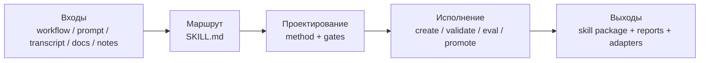

# Описание Yao Meta Skill

`YAO = Yielding AI Outcomes` означает ориентацию на реальные результаты от ИИ. Цель здесь не в том, чтобы написать больше prompt-текста, а в том, чтобы получать переиспользуемые AI-активы и прикладные операционные результаты.

`yao-meta-skill` — это легкая, но строгая система для создания, оценки, упаковки и управления переиспользуемыми agent skills.

Он преобразует сырые workflows, transcripts, prompts, notes и runbooks в переиспользуемые skill-пакеты с:

- понятной поверхностью срабатывания
- компактным `SKILL.md`
- необязательными references, scripts и evals
- более человечным коротким intent dialogue перед глубокой разработкой, с intent confidence gate: если реальная работа, результат, exclusions или стандарты все еще неясны, система продолжает уточнять
- silent-by-default GitHub benchmark scan и reference synthesis до глубокого authoring: система изучает сильные публичные репозитории и world-class pattern tracks, а пользователю явно показывает только реальные конфликты или неопределенность
- явным запросом пользовательских референсов, если они есть, чтобы перенимать паттерны, структуру и стандарты качества, а не копировать формулировки или приватный материал
- автоматически создаваемым минималистичным HTML-обзором на белом фоне для каждого нового skill
- тремя наиболее ценными направлениями следующей итерации после первого создания
- компактным HTML review viewer для быстрой первой ручной оценки
- легким feedback log, чтобы не запускать полный promotion flow на каждом цикле
- отчетом with-skill vs baseline для быстрого сравнения инкрементальной пользы
- conversation-style archetype-aware quickstart, который ведет пользователя как discovery flow и помогает выбрать scaffold, production, library или governed форму
- нейтральными исходными метаданными и клиентскими адаптерами
- встроенными проверками governance, promotion и portability в стандартном потоке

## Архитектура

В hero-версии вся система сводится к одной линии: превратить разрозненный вход в управляемый и переиспользуемый skill package.



Как читать это за 10 секунд:

- **Входы**: стартуем с workflow, prompt, документов и заметок.
- **Маршрут**: компактный `SKILL.md` сначала задает границу и trigger.
- **Проектирование**: выбираются нужные archetype, quality gates и разбиение ресурсов.
- **Исполнение**: единый CLI создает, проверяет, оптимизирует и продвигает skill.
- **Выходы**: результатом становится skill package плюс доказательства оценки, governance и portability.

## Взвешенный quality benchmark

Это инженерная оценка проекта. Каждое измерение оценивается по шкале `0-10`, затем пересчитывается в `100` баллов с учетом веса. GitHub stars не включаются, потому что они отражают популярность экосистемы, а не инженерное качество meta-skill.

Формула взвешенного балла: `sum(score / 10 * weight)`.

| Meta Skill | Методология 15 | Context discipline 10 | Toolchain 15 | Eval/tests 20 | Governance 15 | Portability 10 | Onboarding/review 5 | Local reliability 10 | Weighted score |
| --- | ---: | ---: | ---: | ---: | ---: | ---: | ---: | ---: | ---: |
| Yao Meta Skill | 9.5 | 8.0 | 9.5 | 9.5 | 9.5 | 9.0 | 6.5 | 9.5 | 91.5 |
| Anthropic Skill Creator | 9.0 | 6.5 | 8.5 | 7.5 | 4.0 | 5.0 | 7.5 | 5.0 | 67.5 |
| OpenAI Skill Creator | 8.5 | 9.5 | 5.0 | 2.0 | 3.0 | 4.0 | 8.5 | 4.0 | 50.5 |

| Место | Meta Skill | Балл | Основное позиционирование |
| ---: | --- | ---: | --- |
| 1 | Yao Meta Skill | 91.5 | Полная система engineering, evaluation, governance и portability для переиспользуемых skills. |
| 2 | Anthropic Skill Creator | 67.5 | Сильная методология и итерационный цикл, но слабее local execution reliability и governance coverage. |
| 3 | OpenAI Skill Creator | 50.5 | Лучше как краткое руководство по написанию skills, чем как полноценная engineering system. |

## Подходящие сценарии

- Выбирайте **Yao Meta Skill**, если нужен командный переиспользуемый актив с явными границами, evaluation gates, governance, portability и долгосрочной поддержкой.
- Выбирайте **Anthropic Skill Creator**, если вам важнее conversation-first creation loop и итерация с сильным human guidance.
- Выбирайте **OpenAI Skill Creator**, если вам нужен краткий reference по написанию lean skills и context discipline.
- Практичный гибридный вариант: сначала получить первый черновик через conversation-driven creator, а затем использовать `yao-meta-skill`, чтобы усилить пакет и сделать его team-ready.

## Быстрый старт

1. Опишите workflow, набор prompts или повторяющуюся задачу, которую хотите превратить в skill.
2. Сначала проведите короткий, но более человечный intent dialogue, чтобы уточнить реальную job-to-be-done, outputs, exclusions, constraints и те стандарты качества, которые для вас важны.
3. Сначала позвольте `quickstart` прояснить намерение, затем тихо выполнить benchmark scan и reference synthesis. Явные уточнения поднимаются только тогда, когда intent все еще неясен или между маршрутами проектирования есть реальный конфликт.
4. Используйте archetype-aware `quickstart` или полный authoring flow, чтобы сгенерировать или улучшить пакет в режиме scaffold, production, library или governed.
5. Каждый новый skill также получает `reports/intent-dialogue.md`, `reports/intent-confidence.md`, `reports/reference-synthesis.md`, `reports/skill-overview.html`, `reports/review-viewer.html` и `reports/iteration-directions.md`. После этого feedback log и baseline compare позволяют запускать короткий цикл улучшений без полного promotion flow.

## Текущие результаты

- `make test` сейчас проходит
- на текущем regression-наборе trigger eval дает `0` false positives и `0` false negatives
- все три набора train / dev / holdout проходят
- реальные китайские формулировки теперь включены в trigger eval, например `做一个 skill`, `沉淀成可复用能力`, `优化已有 skill`, `补 trigger 评测`
- packaging contracts для `openai`, `claude` и `generic` проходят проверку

## Текущие сильные стороны

В последней взвешенной оценке Yao набирает `91.5/100`. Его сильные стороны сосредоточены в том, что нужно для долговечных командных skill-активов:

- **Глубина методологии `9.5`**: формальная skill engineering doctrine, archetypes, gate selection, non-skill decisions, governance и resource boundaries.
- **Полнота toolchain `9.5`**: initialization, validation, benchmark scan, description optimization, reporting, promotion checks, packaging, CI и portability checks связаны в один operational flow.
- **Строгость Eval / tests `9.5`**: train/dev/holdout, blind holdout, adversarial holdout, judge-backed blind eval, route confusion, drift history и promotion gates покрыты.
- **Governance / lifecycle `9.5`**: важные skills могут иметь owner, lifecycle, review cadence, maturity score, trust boundary, promotion decision и regression history.
- **Local execution reliability `9.5`**: репозиторий проверяется локально через `make test`, `make ci-test` и unified CLI.
- **Portability / distribution `9.0`**: neutral metadata, adapters, degradation rules, packaging contracts и portability score сохраняют переносимую семантику между средами.
- **Context discipline `8.0`**: entrypoint остается в рамках budget, но эта метрика отслеживается как живое ограничение, потому что система несет больше reports, examples, benchmark assets и evidence.
- **Onboarding / review experience `6.5`**: quickstart, HTML overview, side-by-side review viewer и feedback log улучшили первый опыт, но это все еще главный UX-направление для улучшения.

Общий вектор здесь осознанный: легкий вход, сложная для имитации evaluation, видимая governance и снижение трения первого создания и ручного review.

## Почему Yao

- **Легкий**: entrypoint остается компактным, context budgets заданы явно, а дополнительная структура добавляется только тогда, когда она действительно окупается.
- **Строгий**: качество trigger проверяется через family regressions, blind holdout, adversarial holdout, route confusion, judge-backed blind eval и promotion gates.
- **Управляемый**: важные skills рассматриваются как поддерживаемые активы с lifecycle, maturity expectation, owner и review cadence.
- **Портируемый**: source metadata остается нейтральной, а adapters, degradation rules и packaging contracts сохраняют переносимую семантику между средами.

## Что делает проект

Этот проект помогает создавать, перерабатывать, оценивать и упаковывать skills как долговечные capability-пакеты, а не как одноразовые prompts.

Его логика проста:

1. определить реальную повторяющуюся задачу за пользовательским запросом
2. задать чистую границу skill, чтобы один пакет решал одну связанную задачу
3. оптимизировать trigger description до того, как раздувать основное тело
4. держать основной файл маленьким, а детали переносить в references или scripts
5. добавлять quality gates только тогда, когда они действительно окупаются
6. экспортировать compatibility artifacts только для реально нужных клиентов

## Зачем нужен этот проект

У большинства команд важные операционные знания разбросаны по чатам, личным prompts, устным привычкам и недокументированным workflows. Этот проект превращает такое скрытое знание в:

- обнаруживаемые skill-пакеты
- повторяемые execution flows
- инструкции с меньшей нагрузкой на контекст
- переиспользуемые командные активы
- готовые к совместимости дистрибутивы

## Структура репозитория

```text
yao-meta-skill/
├── SKILL.md
├── README.md
├── LICENSE
├── .gitignore
├── agents/
│   └── interface.yaml
├── references/
├── scripts/
└── templates/
```

## Ключевые компоненты

### `SKILL.md`

Главная точка входа skill. Здесь задаются surface trigger, operating modes, compact workflow и output contract.

### `agents/interface.yaml`

Нейтральный единый источник метаданных. Он хранит display и compatibility metadata, не привязывая дерево исходников к vendor-specific path.

### `references/`

Длинные материалы, которые не должны раздувать основной skill-файл. Здесь находятся design rules, evaluation guidance, compatibility strategy и quality rubrics.

### `scripts/`

Утилиты, которые делают meta-skill по-настоящему рабочей:

- `trigger_eval.py`: проверяет, не слишком ли широкая или слабая trigger description
- `context_sizer.py`: оценивает вес контекста и предупреждает, если initial load становится слишком большим
- `cross_packager.py`: собирает client-specific export artifacts из нейтрального исходного пакета

### `templates/`

Стартовые шаблоны для простых и более сложных skill-пакетов.

## Как использовать

### 1. Использовать skill напрямую

Вызывайте `yao-meta-skill`, когда хотите:

- создать новую skill
- улучшить существующую skill
- добавить evals в skill
- превратить workflow в переиспользуемый пакет
- подготовить skill для более широкого использования в команде

### 2. Сгенерировать новый skill-пакет

Типичный поток:

1. описать workflow или capability
2. определить trigger phrases и expected outputs
3. выбрать режим scaffold, production или library
4. сгенерировать пакет
5. при необходимости запустить size и trigger checks
6. экспортировать targeted compatibility artifacts

### 3. Экспортировать compatibility artifacts

Примеры:

```bash
python3 scripts/cross_packager.py ./yao-meta-skill --platform openai --platform claude --zip
python3 scripts/context_sizer.py ./yao-meta-skill
python3 scripts/trigger_eval.py --description "Create and improve agent skills..." --cases ./cases.json
```

## Преимущества

- **Сначала метод, а не просто prompt**: skill creation рассматривается как формальный engineering workflow
- **Ориентация на trigger optimization**: description проходит через route confusion, blind holdout, adversarial families и promotion policy
- **Легкий entrypoint**: `SKILL.md` остается компактным, а references, scripts и evals добавляются только когда действительно нужны
- **Цельная toolchain**: init, validate, optimize, report, package и test проходят через единый CLI и CI path
- **Управляется как актив**: важные skills могут иметь owner, lifecycle, maturity expectation и review cadence
- **Портируемость по умолчанию**: исходники нейтральны, а совместимость обрабатывается через adapters и degradation rules
- **Высокая плотность доказательств**: route scorecards, regression history, context budgets, portability scores и promotion decisions публикуются как артефакты

## Для кого подходит

Проект лучше всего подходит для:

- agent builders
- команд внутреннего tooling
- prompt engineers, переходящих к skill engineering
- организаций, создающих библиотеки переиспользуемых skills

## Лицензия

MIT. См. [LICENSE](../LICENSE).
