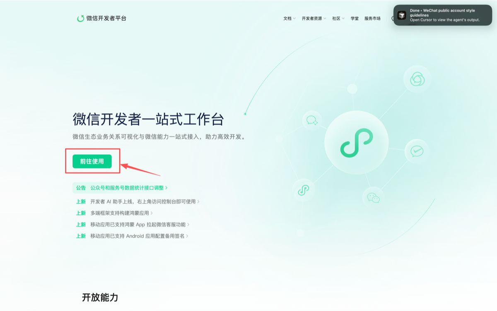

# YouMind WeChat Skill

微信公众号 AI Skill。对 Agent 说一句话，自动跑完选题、写作、配图、排版、发布到草稿箱。

---

## 一句话能干嘛

| 你说 | Skill 做 |
|------|----------|
| `给 demo 写一篇公众号文章` | 全自动 8 步：热点 → 选题 → 写作 → SEO → 配图 → 排版 → 发到草稿箱 |
| `写一篇关于高考志愿的文章` | 跳过热点，直接围绕指定主题走流程 |
| `把这篇 Markdown 发到草稿箱` | 跳过写作，直接排版发布 |
| `用紫色 decoration 主题预览` | 换主题换色，即时预览 |
| `看看最近 7 天文章表现` | 拉数据、分析 top/flop、给下一篇建议 |
| `根据我的修改学习风格` | 从你的人工改稿中提取经验，下次写得更像你 |
| `创建新客户 my-brand` | 自动建目录、引导填品牌配置 |

---

## 安装

> 环境要求：Node.js ≥ 18、Python ≥ 3.9、已认证微信公众号（需 API 权限）

```bash
# 1. 安装依赖
cd toolkit && npm install && npm run build && cd ..
pip install -r requirements.txt

# 2. 生成配置文件（如果 config.yaml 不存在）
cp config.example.yaml config.yaml

# 3. 获取公网 IP（填入微信 IP 白名单，否则无法发布，详见下方「获取本机公网 IP」）
curl -s https://ifconfig.me
```

`config.yaml` 需要填写以下凭证：

| 字段 | 必填 | 说明 |
|------|------|------|
| `wechat.appid` | **是** | 微信公众号 AppID |
| `wechat.secret` | **是** | 微信公众号 AppSecret |
| `wechat.author` | 否 | 文章作者名，默认 "YouMind" |
| `youmind.api_key` | 推荐 | 用于知识库搜索、联网搜索、文章归档、AI 生图 → [获取 API Key](https://youmind.com/settings/api-keys?utm_source=youmind-wechat-article) |
| `image.providers.*.api_key` | 否 | 配了哪个就启用哪个（youmind / gemini / openai / doubao） |

### 获取 AppID / AppSecret / 配置 IP 白名单

> 微信开发者平台控制台：<https://developers.weixin.qq.com/platform?tab1=basicInfo&tab2=dev>

**第 1 步 — 进入微信开发者平台**

打开 [微信开发者平台](https://developers.weixin.qq.com/platform?tab1=basicInfo&tab2=dev)，点击首页的 **「前往使用」** 按钮登录。



**第 2 步 — 选择公众号**

在「我的业务」面板中，找到并点击 **「公众号」** 进入公众号管理页。


**第 3 步 — 复制 AppID、AppSecret 并配置 IP 白名单**

在公众号 → **基础信息** 页面：

1. **AppID** — 顶部「基础信息」区域直接复制，填入 `config.yaml` 的 `wechat.appid`
2. **AppSecret** — 「开发密钥」区域，点击 **重置** 获取（只展示一次，请立即保存），填入 `wechat.secret`
3. **API IP 白名单** — 同一区域，点击 **编辑**，将你的公网 IP 粘贴进去


### 获取本机公网 IP

家庭宽带 IP 会变，发布报 IP 错误时重新获取并更新白名单即可。

**macOS**

```bash
curl -s https://httpbin.org/ip | python3 -c "import sys,json; print(json.load(sys.stdin)['origin'])"
# 或者
curl -s https://ifconfig.me
```

**Windows（PowerShell）**

```powershell
(Invoke-WebRequest -Uri "https://ifconfig.me" -UseBasicParsing).Content.Trim()
# 或者
(Invoke-RestMethod -Uri "https://httpbin.org/ip").origin
```

**Linux**

```bash
curl -s https://ifconfig.me
# 或者
curl -s https://httpbin.org/ip | python3 -c "import sys,json; print(json.load(sys.stdin)['origin'])"
```

> **提示**：拿到 IP 后，回到上面第 3 步的「API IP 白名单」→ 编辑，粘贴保存即可。

---

## 使用技巧

### 两种运行模式

- **自动模式**（默认）：全程自动跑，只在生成配图前问一次图片风格偏好
- **交互模式**：说"让我来选题" / "交互模式"，会在选题、框架、配图、主题环节暂停让你选

### 主题系统

4 款内置主题，搭配任意 HEX 色值：

| 主题 | 风格 | 适合 |
|------|------|------|
| `simple` | 简约干净 | 日常推送、知识科普 |
| `center` | 居中排版 | 短篇、金句、情感 |
| `decoration` | 装饰线条 | 品牌感强的内容 |
| `prominent` | 大标题 | 深度长文、观点输出 |

<!-- TODO: 主题对比截图 -->

想要更深的定制？用 Theme DSL 写一个自定义主题 JSON，放到 `clients/{client}/themes/` 下，发布时加 `--custom-theme` 即可。

### 配图降级链

Skill 按以下顺序尝试生成配图，任何一环成功就继续，全挂也不中断流程：

```
AI 生图（你配的 provider）→ Nano Banana Pro 图库搜索 → CDN 预制封面下载 → 只输出 prompt
```

### 多客户管理

每个客户一个目录，互不干扰：

```
clients/demo/
├── style.yaml      # 品牌调性、目标读者、禁用词
├── playbook.md     # 写作手册（自动生成或手写）
├── history.yaml    # 已发布记录（去重用）
├── corpus/         # 历史语料
├── lessons/        # 人工改稿经验
└── themes/         # 专属主题
```

对 Agent 说 `创建新客户 xxx` 即可自动初始化。

### 让文章越写越像你

1. **喂语料**：往 `clients/{client}/corpus/` 里放 20+ 篇你的历史文章，跑 `build-playbook` 生成写作手册
2. **改稿学习**：发布后手动改，然后说"根据我的修改学习风格"——Skill 会提取差异存到 `lessons/`
3. **手册迭代**：每积累 5 条经验，自动刷新 `playbook.md`

### 流程不会断

每一步都有 fallback。热点抓不到就联网搜，联网搜也挂就问你；图生不出来就搜图库；发布失败就生成本地 HTML。单步失败只会跳过并标注，不会卡死。

---

## 常见问题

**发布报 IP 错误** — 公网 IP 变了。重跑 `curl -s https://ifconfig.me` 拿新 IP，更新微信白名单（详见上方「获取本机公网 IP」章节）。

**图片生成失败** — 不影响发布。Skill 会自动走降级链。想用特定 provider 就在 `config.yaml` 里填对应 key。

**文章有 AI 味** — 在 `style.yaml` 里写清楚你的调性；多喂历史语料建 playbook；发布后改稿再跑"学习风格"。三管齐下效果最好。

**怎么自定义排版？** — 三个层级：① 对话里指定颜色字号 → ② 写 Theme DSL JSON → ③ 搭配设计类 Skill 深度定制。

---

## 许可证

MIT
