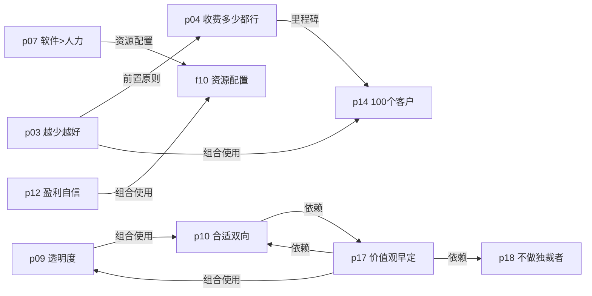
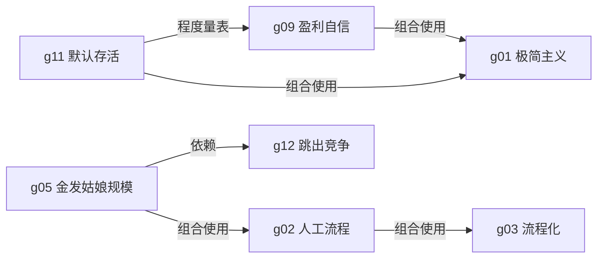
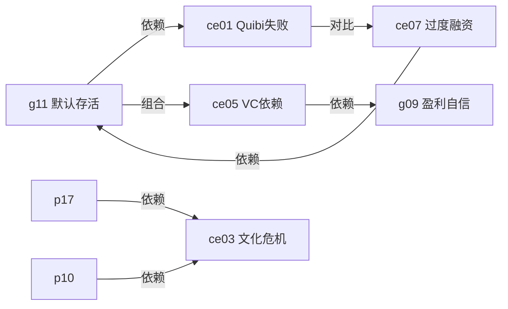
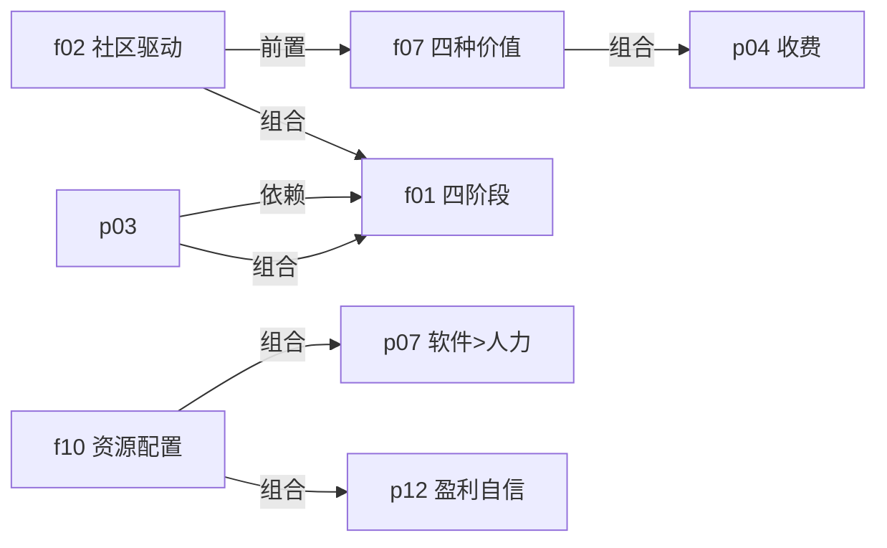
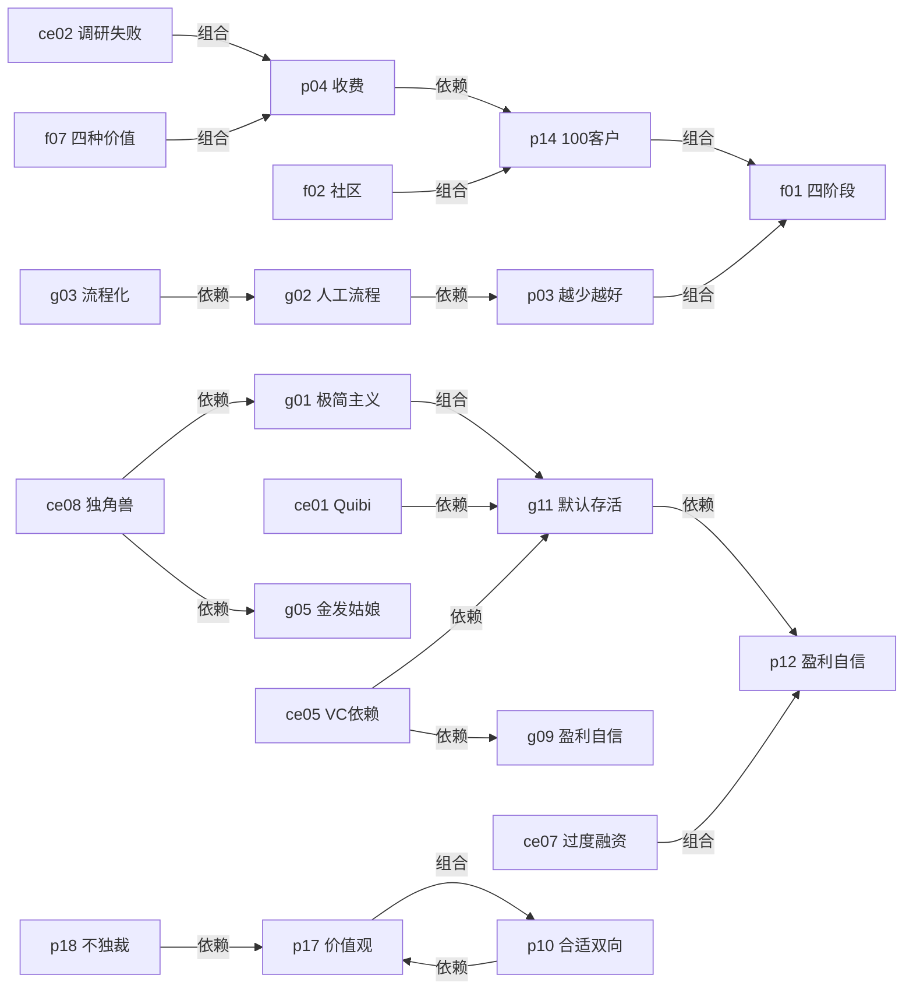

# 小而美 & 极简主义创业 — Skill Index

> 本书由 book2skill 蒸馏, 共产出 **27** 个 skills。
> 处理时间: 2026-04-17

## 关于这本书

- **书名**: 《小而美》+ 《极简主义创业》
- **作者**: 萨希尔·拉文吉亚 (Sahil Lavignena)
- **出版年**: 2022 / 2024
- **一句话主旨**: 盈利优先于规模，用最少资源验证，先社区后产品，从人工服务到自动化
- **整书理解**: 见 [BOOK_OVERVIEW.md](./BOOK_OVERVIEW.md)

---

## Skill 列表 (按主题分组)

### 概念词典 (g) — 核心术语和定义

- [`g01-minimalist-entrepreneur`](./g01-minimalist-entrepreneur/SKILL.md) — 极简主义创业者
  > 核心洞察: 主动选择"足够"而非被动"做不大"，盈利优先于规模

- [`g02-manual-valuable-process`](./g02-manual-valuable-process/SKILL.md) — 有价值的人工流程 (MVP前置)
  > 核心洞察: 用人工服务代替代码来验证商业假设，基于真实反馈而非假设

- [`g03-processize`](./g03-processize/SKILL.md) — 流程化 (将...变成流程)
  > 核心洞察: 先发现做某事的最佳方式并记录，再考虑自动化

- [`g05-goldilocks-size`](./g05-goldilocks-size/SKILL.md) — 金发姑娘规模
  > 核心洞察: 不大不小、不烫不冷——大公司不屑于进入的缝隙市场

- [`g09-profitable-confidence`](./g09-profitable-confidence/SKILL.md) — 盈利自信
  > 核心洞察: 停止营销后收入下降速度<5% = 结构健康，盈利给你"可以说不"的能力

- [`g11-default-alive`](./g11-default-alive/SKILL.md) — 默认存活/死亡
  > 核心洞察: 只问一个二元问题——如果停止主动销售，公司会存活还是死亡

- [`g12-outcompete`](./g12-outcompete/SKILL.md) — 跳出竞争
  > 核心洞察: 如何避免竞争——在细分市场成为唯一，而非在大市场成为第二

---

### 产品验证 (p) — 实践原则和方法

- [`p03-less-is-more`](./p03-less-is-more/SKILL.md) — 越少越好
  > 核心洞察: 不是减少功能，而是完全替换工具——从代码降到人工

- [`p04-charge-anything`](./p04-charge-anything/SKILL.md) — 收费多少都行
  > 核心洞察: 免费用户和付费用户是两类人，付费行为是最强的需求信号

- [`p07-software-not-labor`](./p07-software-not-labor/SKILL.md) — 软件优先于人力
  > 核心洞察: 软件规模化成本固定，人力规模化成本线性

- [`p09-transparency`](./p09-transparency/SKILL.md) — 透明度原则
  > 核心洞察: 透明度不是为了民主，而是消除信息差导致的决策失真

- [`p10-mutual-fit`](./p10-mutual-fit/SKILL.md) — 合适是双向的
  > 核心洞察: 招聘不是单向评估，而是双向选择，双向不匹配应尽早分手

- [`p12-profitability-confidence`](./p12-profitability-confidence/SKILL.md) — 盈利自信原则
  > 核心洞察: 盈利给你"可以说不"的能力，接受投资不只是获得资金

- [`p14-100customers`](./p14-100customers/SKILL.md) — 100个客户里程碑
  > 核心洞察: 100个付费回头客同时验证需求、产品和增长三个维度

- [`p17-values-early-often`](./p17-values-early-often/SKILL.md) — 价值观要早定常定
  > 核心洞察: 价值观不是墙上挂的标语，而是创始人每天在做的事

- [`p18-no-product-dictator`](./p18-no-product-dictator/SKILL.md) — 不要做产品独裁者
  > 核心洞察: 决策权威不等于信息权威，用证据而非职位做决定

---

### 框架 (f) — 结构化分析工具

- [`f01-four-stage-evolution`](./f01-four-stage-evolution/SKILL.md) — 四阶段演进框架
  > 核心洞察: 人工→流程化→产品化→自动化，按正确顺序完成，不要跳过

- [`f02-community-driven`](./f02-community-driven/SKILL.md) — 社区驱动创业
  > 核心洞察: 社区→问题→解决方案，不是"我有好点子找人买单"

- [`f07-four-value-types`](./f07-four-value-types/SKILL.md) — 企业价值四类型
  > 核心洞察: 地理位置/形式/时间/所有权，创业机会在未被充分满足的价值类型中

- [`f10-resource-allocation-stage`](./f10-resource-allocation-stage/SKILL.md) — 发展阶段资源配置
  > 核心洞察: 早期用时间换钱，中期用钱换时间，后期用钱买精力

---

### 反例 (ce) — 失败案例和警示

- [`ce01-quibi-failure`](./ce01-quibi-failure/SKILL.md) — Quibi的18亿美元失败
  > 核心洞察: 超额融资掩盖PMF缺失，钱越多越危险——跳过验证

- [`ce02-interintellect-failure`](./ce02-interintellect-failure/SKILL.md) — Interintellect的调研失败
  > 核心洞察: 口头承诺≠付费意愿，调研热情与实际使用差距巨大

- [`ce03-simplyeloped-crisis`](./ce03-simplyeloped-crisis/SKILL.md) — Simply Eloped文化危机
  > 核心洞察: 技能可学，价值观冲突不可解，文化问题积累后成本极高

- [`ce05-vc-dependency-hallucination`](./ce05-vc-dependency-hallucination/SKILL.md) — 风投依赖幻觉
  > 核心洞察: 风投的激励(高倍数)≠创始人的激励(活下去)，依赖外部救援是认知偏差

- [`ce07-overfunding-trap`](./ce07-overfunding-trap/SKILL.md) — 过度融资陷阱
  > 核心洞察: 钱多导致的过度扩张比钱少导致的保守更危险

- [`ce08-unicorn-chasing-cost`](./ce08-unicorn-chasing-cost/SKILL.md) — 追逐独角兽的代价
  > 核心洞察: 追逐规模让你忘记为什么要做这件事，"小而美"是主动选择

---

## 主题内引用图

### 产品验证 (p) 主题内



### 概念词典 (g) 主题内



### 反例 (ce) 主题内



### 框架 (f) 主题内



---

## 主题间引用图



---

## 核心依赖链

```
最基础:
g05 金发姑娘规模
  └─> g02 人工流程
        └─> g03 流程化
              └─> (可自动化)

并行发展:
g11 默认存活 ←─┐
  └─> g09 盈利自信 ──┼─> g01 极简主义创业者
                      └─> g12 跳出竞争

产品验证链:
p03 越少越好 ──┬─> p04 收费多少都行 ──> p14 100客户 ──> f01 四阶段演进
               └─> p07 软件优先于人力 ──> f10 资源配置

团队管理链:
p17 价值观早定 ──> p10 合适双向 ──> p09 透明度
                            └─> p18 不做独裁者
```

---

## 阅读路径建议

### 路径一：验证型 — 从零开始验证想法

适合: 刚有创业想法，不确定市场是否需要

```
1. g05 金发姑娘规模
   → 先选对市场，找到大公司不屑进入的缝隙

2. f02 社区驱动创业
   → 从社区发现真实问题，而非闭门造车

3. g02 人工流程
   → 用人工服务验证，不写一行代码

4. g03 流程化
   → 找到最佳方式并记录下来

5. p04 收费多少都行
   → 付费行为是最强的需求信号

6. p14 100个客户
   → 100个付费回头客 = PMF达成
```

### 路径二：增长型 — PMF达成后考虑扩张

适合: 已有产品，需要决定是否扩张、如何扩张

```
1. p14 100个客户
   → 确认PMF，不要跳过这个里程碑

2. p03 越少越好
   → 继续克制，每次只增加必要的东西

3. f01 四阶段演进
   → 按正确顺序：人工→流程化→产品化→自动化

4. f10 资源配置
   → 不同阶段用不同策略

5. p07 软件优先于人力
   → 优先用软件解决，软件不行再用人力

6. g12 跳出竞争
   → 在细分成为唯一，而非在大市场硬碰硬
```

### 路径三：治理型 — 有团队，考虑文化和融资

适合: 有产品有团队，面临文化、融资决策挑战

```
1. g11 默认存活
   → 先问：公司能活多久？停止销售会死吗？

2. g09 盈利自信
   → 盈利给你"可以说不"的能力

3. p12 盈利自信原则
   → 盈利是战略资产，不只是财务目标

4. ce05 VC依赖幻觉
   → 风投的激励≠你的激励，不要依赖外部救援

5. p17 价值观早定常定
   → 招人之前先定义价值观

6. p10 合适是双向的
   → 招聘和裁员都要双向评估

7. p09 透明度原则
   → 信息对称减少决策失真
```

---

## 审计轨迹

- Skill 候选池: 27 个已确认
- 关系数统计: 约 35 条依赖/对比/组合关系
- 索引生成: 2026-04-17
- 引用图: 见 [REFERENCE_GRAPH.md](./REFERENCE_GRAPH.md)

---

## 接入 darwin-skill

所有 skill 均带有 `test-prompts.json` (darwin-skill 兼容格式), 可直接接入自动进化:

```
darwin evolve books/xiaomiao/
```
