# 小而美 & 极简主义创业 — 完整引用图

> 本文档展示所有 27 个 skill 之间的关联关系（引用/补充/对立/递进）
> 生成时间: 2026-04-17

---

## 图例说明

- `-->` depends-on (依赖): A 的使用前提是先理解 B
- `-.->` contrasts-with (对比): A 和 B 是两种可选方案
- `==>` composes-with (组合): A 和 B 经常配合使用

---

## 完整引用图 (Mermaid Flowchart)

```mermaid
flowchart TB
    %% ==================== 概念词典 (g) ====================
    subgraph g["概念词典 (g) - 核心术语"]
        g01["g01 极简主义创业者"]
        g02["g02 人工流程 MVP前置"]
        g03["g03 流程化"]
        g05["g05 金发姑娘规模"]
        g09["g09 盈利自信"]
        g11["g11 默认存活"]
        g12["g12 跳出竞争"]
    end

    %% ==================== 产品验证 (p) ====================
    subgraph p["产品验证 (p) - 实践原则"]
        p03["p03 越少越好"]
        p04["p04 收费多少都行"]
        p07["p07 软件优先于人力"]
        p09["p09 透明度原则"]
        p10["p10 合适是双向的"]
        p12["p12 盈利自信原则"]
        p14["p14 100个客户"]
        p17["p17 价值观早定常定"]
        p18["p18 不要做产品独裁者"]
    end

    %% ==================== 框架 (f) ====================
    subgraph f["框架 (f) - 结构化工具"]
        f01["f01 四阶段演进"]
        f02["f02 社区驱动创业"]
        f07["f07 企业价值四类型"]
        f10["f10 发展阶段资源配置"]
    end

    %% ==================== 反例 (ce) ====================
    subgraph ce["反例 (ce) - 失败警示"]
        ce01["ce01 Quibi失败"]
        ce02["ce02 Interintellect调研失败"]
        ce03["ce03 SimplyEloped文化危机"]
        ce05["ce05 VC依赖幻觉"]
        ce07["ce07 过度融资陷阱"]
        ce08["ce08 追逐独角兽代价"]
        ce11["ce11 更好方案分散注意力"]
    end

    %% ==================== 依赖关系 (depends-on) ====================
    g05 -->|depends-on| g12
    g02 -->|depends-on| g05
    g03 -->|depends-on| g02
    g12 -->|depends-on| g05
    
    g09 -->|depends-on| g11
    g01 -->|depends-on| g09
    g01 -->|depends-on| g11
    
    p03 -->|depends-on| p04
    p04 -->|depends-on| p03
    p14 -->|depends-on| p04
    
    p10 -->|depends-on| p17
    p18 -->|depends-on| p17
    
    p12 -->|depends-on| p04
    
    f01 -->|depends-on| p03
    f07 -->|depends-on| f02
    
    ce01 -->|depends-on| g11
    ce05 -->|depends-on| g11
    ce05 -->|depends-on| g09
    ce07 -->|depends-on| g11
    ce07 -->|depends-on| g05
    ce08 -->|depends-on| g01
    ce08 -->|depends-on| g05
    ce08 -->|depends-on| g09
    ce03 -->|depends-on| p10
    ce03 -->|depends-on| p17
    ce02 -->|depends-on| g02
    ce11 -->|depends-on| g02
    ce11 -->|depends-on| g03

    %% ==================== 对比关系 (contrasts-with) ====================
    g01 -.->|contrasts-with| ce08
    ce01 -.->|contrasts-with| ce07
    ce02 -.->|contrasts-with| p04
    ce11 -.->|contrasts-with| p03

    %% ==================== 组合关系 (composes-with) ====================
    g09 ==>|"composes-with"| g01
    g11 ==>|"composes-with"| g01
    g05 ==>|"composes-with"| g02
    g02 ==>|"composes-with"| g03
    g11 ==>|"composes-with"| g09
    
    p03 ==>|"composes-with"| p14
    p04 ==>|"composes-with"| p14
    p04 ==>|"composes-with"| p12
    p07 ==>|"composes-with"| f10
    p12 ==>|"composes-with"| f10
    p17 ==>|"composes-with"| p10
    p17 ==>|"composes-with"| p09
    p09 ==>|"composes-with"| p10
    
    f02 ==>|"composes-with"| f01
    f02 ==>|"composes-with"| f07
    f01 ==>|"composes-with"| p14
    f07 ==>|"composes-with"| p04
    f10 ==>|"composes-with"| p07
    f10 ==>|"composes-with"| p12
    
    ce01 ==>|"composes-with"| g01
    ce05 ==>|"composes-with"| g01
    ce07 ==>|"composes-with"| p12
    ce02 ==>|"composes-with"| g09
```

---

## 详细关系列表

### 依赖关系 (depends-on) - 15条

| 来源 | 目标 | 说明 |
|------|------|------|
| g12-outcompete | g05-goldilocks-size | 跳出竞争依赖市场选择框架 |
| g02-manual-valuable-process | g05-goldilocks-size | 人工流程依赖先选对市场 |
| g03-processize | g02-manual-valuable-process | 流程化依赖人工验证结果 |
| g09-profitable-confidence | g11-default-alive | 盈利自信依赖默认存活诊断 |
| g01-minimalist-entrepreneur | g09-profitable-confidence | 极简主义依赖盈利自信 |
| g01-minimalist-entrepreneur | g11-default-alive | 极简主义依赖默认存活 |
| p04-charge-anything | p03-less-is-more | 收费原则前置越少越好 |
| p14-100customers | p04-charge-anything | 100客户依赖收费信号 |
| p10-mutual-fit | p17-values-early-often | 双向合适依赖价值观定义 |
| p18-no-product-dictator | p17-values-early-often | 不做独裁者依赖价值观框架 |
| p12-profitability-confidence | p04-charge-anything | 盈利自信依赖收费原则 |
| f01-four-stage-evolution | p03-less-is-more | 四阶段框架依赖越少越好 |
| f07-four-value-types | f02-community-driven | 四种价值依赖社区发现问题 |
| ce05-vc-dependency-hallucination | g11-default-alive | VC依赖幻觉需要Default Alive诊断 |
| ce05-vc-dependency-hallucination | g09-profitable-confidence | VC依赖幻觉需要盈利自信概念 |
| ce07-overfunding-trap | g11-default-alive | 过度融资陷阱依赖Default Alive |
| ce07-overfunding-trap | g05-goldilocks-size | 过度融资陷阱依赖市场选择 |
| ce08-unicorn-chasing-cost | g01-minimalist-entrepreneur | 独角兽代价需要极简主义对比 |
| ce08-unicorn-chasing-cost | g05-goldilocks-size | 独角兽代价需要金发姑娘规模 |
| ce08-unicorn-chasing-cost | g09-profitable-confidence | 独角兽代价需要盈利自信概念 |
| ce01-quibi-failure | g11-default-alive | Quibi失败需要Default Alive诊断 |
| ce03-simplyeloped-crisis | p10-mutual-fit | 文化危机需要双向合适判断 |
| ce03-simplyeloped-crisis | p17-values-early-often | 文化危机需要价值观早定 |
| ce02-interintellect-failure | g02-manual-valuable-process | 调研失败需要人工验证概念 |

### 对比关系 (contrasts-with) - 3条

| 来源 | 目标 | 说明 |
|------|------|------|
| g01-minimalist-entrepreneur | ce08-unicorn-chasing-cost | 极简主义 vs 追逐独角兽 |
| ce01-quibi-failure | ce07-overfunding-trap | 资金掩盖PMF vs 融资后过度扩张 |
| ce02-interintellect-failure | p04-charge-anything | 调研不可靠 vs 付费验证可靠 |

### 组合关系 (composes-with) - 20条

| 来源 | 目标 | 说明 |
|------|------|------|
| g09-profitable-confidence | g01-minimalist-entrepreneur | 盈利自信构成极简主义基础 |
| g11-default-alive | g01-minimalist-entrepreneur | 默认存活构成极简主义基础 |
| g05-goldilocks-size | g02-manual-valuable-process | 市场选择与人工流程配合 |
| g02-manual-valuable-process | g03-processize | 人工流程与流程化配合 |
| g11-default-alive | g09-profitable-confidence | 默认存活与盈利自信配合 |
| p03-less-is-more | p14-100customers | 越少越好与100客户配合 |
| p04-charge-anything | p14-100customers | 收费与100客户配合 |
| p04-charge-anything | p12-profitability-confidence | 收费与盈利自信配合 |
| p07-software-not-labor | f10-resource-allocation-stage | 软件优先与资源配置配合 |
| p12-profitability-confidence | f10-resource-allocation-stage | 盈利自信与资源配置配合 |
| p17-values-early-often | p10-mutual-fit | 价值观与双向合适配合 |
| p17-values-early-often | p09-transparency | 价值观与透明度配合 |
| p09-transparency | p10-mutual-fit | 透明度与双向合适配合 |
| f02-community-driven | f01-four-stage-evolution | 社区驱动与四阶段配合 |
| f02-community-driven | f07-four-value-types | 社区驱动与四种价值配合 |
| f01-four-stage-evolution | p14-100customers | 四阶段与100客户配合 |
| f07-four-value-types | p04-charge-anything | 四种价值与收费配合 |
| f10-resource-allocation-stage | p07-software-not-labor | 资源配置与软件优先配合 |
| f10-resource-allocation-stage | p12-profitability-confidence | 资源配置与盈利自信配合 |
| ce01-quibi-failure | g01-minimalist-entrepreneur | Quibi案例验证极简主义 |
| ce05-vc-dependency-hallucination | g01-minimalist-entrepreneur | VC依赖验证极简主义 |
| ce07-overfunding-trap | p12-profitability-confidence | 过度融资案例验证盈利自信 |
| ce02-interintellect-failure | g09-profitable-confidence | 调研失败案例验证盈利自信 |

---

## 引用密度统计

| 类别 | 数量 | 占比 |
|------|------|------|
| 总 Skill 数 | 27 | 100% |
| 依赖关系 (depends-on) | 24 | - |
| 对比关系 (contrasts-with) | 3 | - |
| 组合关系 (composes-with) | 23 | - |
| **总关系数** | **50** | - |

**平均每 Skill 连接数**: 50 / 27 ≈ 1.85

---

## 中心性分析

### 最核心的 Skill (连接数最多)

1. **g01-minimalist-entrepreneur** (6条连接)
   - 极简主义是全书核心概念，连接多个反例和基础概念

2. **g11-default-alive** (6条连接)
   - 默认存活是融资和盈利决策的基础

3. **p17-values-early-often** (5条连接)
   - 价值观是团队管理的核心

4. **g09-profitable-confidence** (5条连接)
   - 盈利自信连接融资决策和极简主义

5. **g05-goldilocks-size** (4条连接)
   - 金发姑娘规模连接市场选择和多个反例

### 最边缘的 Skill (连接数最少)

- p18-no-product-dictator (1条连接)
- p09-transparency (2条连接)
- f07-four-value-types (2条连接)

---

## 审计信息

- 生成时间: 2026-04-17
- 关系确认: 手动审查所有27个SKILL.md文件
- 符合Zettelkasten方法论节制原则: 宁可稀疏不制造虚假链接
